## Goals for this Repo and About Me

1. Contribute to the python conda packaging and distribution ecosystem on [conda-forge](https://conda-forge.org/)

2. Support the [conda-forge core team](https://github.com/orgs/conda-forge/teams/core) through sponsorship, testing and documentation.

3. Focus on libraries and software that is built, maintained and supported by
   
    3.1. [Apache](https://www.apache.org/), 
  
    3.2. [Django](https://www.djangoproject.com/foundation/), 
  
    3.3. [Linux AI & Data](https://lfaidata.foundation/),
  
    3.4. [numfocus](https://numfocus.org/), 
  
    3.5. [jazzband](https://jazzband.co/) 
  
    3.6. [finos](https://www.finos.org/)
  
    3.7. [Python Sofrware](https://www.python.org/psf-landing/). 

List Of FeedStocks - As Maintainer

1. conda-forge/a2wsgi-feedstock
2. conda-forge/acachecontrol-feedstock
3. conda-forge/ahlive-feedstock
4. conda-forge/airflow-dbt-feedstock
5. conda-forge/airfly-feedstock
6. conda-forge/alt-profanity-check-feedstock
7. conda-forge/amundsen-common-feedstock
8. conda-forge/amundsen-databuilder-feedstock
9. conda-forge/amundsen-metadata-feedstock
10. conda-forge/amundsen-rds-feedstock
11. conda-forge/amundsen-search-feedstock
12. conda-forge/anchor-exp-feedstock
13. conda-forge/antlr4-tools-feedstock
14. conda-forge/apache-atlas-feedstock
15. conda-forge/asttrs-feedstock
16. conda-forge/asyncmock-feedstock
17. conda-forge/azure-synapse-nspkg-feedstock
18. conda-forge/azure-synapse-spark-feedstock
19. conda-forge/basedtyping-feedstock
20. conda-forge/behave-django-feedstock
21. conda-forge/behave-html-pretty-formatter-feedstock
22. conda-forge/bert-extractive-summarizer-feedstock
23. conda-forge/bokeh-django-feedstock
24. conda-forge/burr-feedstock
25. conda-forge/bynder-sdk-feedstock
26. conda-forge/cmudict-feedstock
27. conda-forge/collate-sqllineage-feedstock
28. conda-forge/collectfasta-feedstock
29. conda-forge/commonregex-feedstock
30. conda-forge/conda-minify-feedstock
31. conda-forge/condense-json-feedstock
32. conda-forge/confusable-homoglyphs-feedstock
33. conda-forge/crispy-bootstrap4-feedstock
34. conda-forge/crispy-bootstrap5-feedstock
35. conda-forge/cssbeautifier-feedstock
36. conda-forge/csv2parquet-feedstock
37. conda-forge/cucumber-expressions-feedstock
38. conda-forge/customersatisfactionmetrics-feedstock
39. conda-forge/daff-feedstock
40. conda-forge/dash-editor-components-feedstock
41. conda-forge/data-wizard-feedstock
42. conda-forge/dataprofiler-feedstock
43. conda-forge/datasette-cluster-map-feedstock
44. conda-forge/datasette-configure-fts-feedstock
45. conda-forge/datasette-copyable-feedstock
46. conda-forge/datasette-dashboards-feedstock
47. conda-forge/datasette-edit-schema-feedstock
48. conda-forge/datasette-enrichments-feedstock
49. conda-forge/datasette-gunicorn-feedstock
50. conda-forge/datasette-insert-feedstock
51. conda-forge/datasette-leaflet-feedstock
52. conda-forge/datasette-nteract-data-explorer-feedstock
53. conda-forge/datasette-parquet-feedstock
54. conda-forge/datasette-render-markdown-feedstock
55. conda-forge/datasette-scraper-feedstock
56. conda-forge/datasette-search-all-feedstock
57. conda-forge/datasette-secrets-feedstock
58. conda-forge/datasette-statistics-feedstock
59. conda-forge/datasette-template-sql-feedstock
60. conda-forge/datasketch-feedstock
61. conda-forge/datasketches-feedstock
62. conda-forge/datastar-py-feedstock
63. conda-forge/db-build-feedstock
64. conda-forge/db-to-sqlite-feedstock
65. conda-forge/dbt-dremio-feedstock
66. conda-forge/detect-test-pollution-feedstock
67. conda-forge/diazo-feedstock
68. conda-forge/django-admin-rangefilter-feedstock
69. conda-forge/django-approval-feedstock
70. conda-forge/django-auditlog-feedstock
71. conda-forge/django-bootstrap-form-feedstock
72. conda-forge/django-breeze-feedstock
73. conda-forge/django-celery-beat-feedstock
74. conda-forge/django-classy-tags-feedstock
75. conda-forge/django-cms-feedstock
76. conda-forge/django-codemirror6-feedstock
77. conda-forge/django-cogwheels-feedstock
78. conda-forge/django-colorful-feedstock
79. conda-forge/django-comments-xtd-feedstock
80. conda-forge/django-constance-feedstock
81. conda-forge/django-cryptography-django5-feedstock
82. conda-forge/django-csvimport-feedstock
83. conda-forge/django-data-browser-feedstock
84. conda-forge/django-db-logger-feedstock
85. conda-forge/django-dbbackup-feedstock
86. conda-forge/django-dcat-feedstock
87. conda-forge/django-entangled-feedstock
88. conda-forge/django-etc-feedstock
89. conda-forge/django-events-timetable-feedstock
90. conda-forge/django-eventtools-feedstock
91. conda-forge/django-excel-tools-feedstock
92. conda-forge/django-extra-views-feedstock
93. conda-forge/django-filebrowser-feedstock
94. conda-forge/django-flags-feedstock
95. conda-forge/django-formtools-feedstock
96. conda-forge/django-funky-sheets-feedstock
97. conda-forge/django-groups-manager-feedstock
98. conda-forge/django-grpc-feedstock
99. conda-forge/django-handyhelpers-feedstock
100. conda-forge/django-health-check-feedstock
101. conda-forge/django-hitcount-feedstock
102. conda-forge/django-hosts-feedstock
103. conda-forge/django-linear-migrations-feedstock
104. conda-forge/django-log-request-id-feedstock
105. conda-forge/django-log-viewer-feedstock
106. conda-forge/django-moderation-feedstock
107. conda-forge/django-mptt-tree-editor-feedstock
108. conda-forge/django-mptt2-feedstock
109. conda-forge/django-nyt-feedstock
110. conda-forge/django-orghierarchy-feedstock
111. conda-forge/django-otlp-log-exporter-feedstock
112. conda-forge/django-plotly-wagtail-feedstock
113. conda-forge/django-pygwalker-feedstock
114. conda-forge/django-registration-feedstock
115. conda-forge/django-revproxy-feedstock
116. conda-forge/django-schema-viewer-feedstock
117. conda-forge/django-sekizai-feedstock
118. conda-forge/django-sesame-feedstock
119. conda-forge/django-slick-reporting-feedstock
120. conda-forge/django-socio-grpc-feedstock
121. conda-forge/django-solo-feedstock
122. conda-forge/django-sql-dashboard-feedstock
123. conda-forge/django-sql-explorer-feedstock
124. conda-forge/django-star-ratings-feedstock
125. conda-forge/django-streamfield-feedstock
126. conda-forge/django-structlog-feedstock
127. conda-forge/django-survey-and-report-feedstock
128. conda-forge/django-tastypie-feedstock
129. conda-forge/django-tenant-schemas-feedstock
130. conda-forge/django-tenant-users-feedstock
131. conda-forge/django-tenants-feedstock
132. conda-forge/django-tex-feedstock
133. conda-forge/django-timezone-field-feedstock
134. conda-forge/django-todo-feedstock
135. conda-forge/django-tree-queries-feedstock
136. conda-forge/django-url-filter-feedstock
137. conda-forge/django-utils-six-feedstock
138. conda-forge/django-vite-feedstock
139. conda-forge/django-vite-plugin-feedstock
140. conda-forge/django-weasyprint-feedstock
141. conda-forge/django-wildewidgets-feedstock
142. conda-forge/django-yugabytedb-feedstock
143. conda-forge/djangocms-attributes-field-feedstock
144. conda-forge/djangocms-frontend-feedstock
145. conda-forge/djangocms-history-feedstock
146. conda-forge/djangocms-icon-feedstock
147. conda-forge/djangocms-link-feedstock
148. conda-forge/djangocms-picture-feedstock
149. conda-forge/djangocms-style-feedstock
150. conda-forge/djangocms-text-ckeditor-feedstock
151. conda-forge/djangorestframework-dataclasses-feedstock
152. conda-forge/djantic-feedstock
153. conda-forge/djlint-feedstock
154. conda-forge/djongo5-feedstock
155. conda-forge/dlt-pendulum-feedstock
156. conda-forge/docstring_parser_fork-feedstock
157. conda-forge/dremio-arrow-feedstock
158. conda-forge/drf-optionalfields-feedstock
159. conda-forge/drf-pydantic-feedstock
160. conda-forge/drf-standardized-errors-feedstock
161. conda-forge/duckdb-server-feedstock
162. conda-forge/feathr-feedstock
163. conda-forge/fixedint-feedstock
164. conda-forge/fixedwidth-feedstock
165. conda-forge/flake518-feedstock
166. conda-forge/flake8-bandit-feedstock
167. conda-forge/flake8-debugger-feedstock
168. conda-forge/flake8-django-feedstock
169. conda-forge/flake8-executable-feedstock
170. conda-forge/flake8-logging-feedstock
171. conda-forge/flake8-no-pep420-feedstock
172. conda-forge/flake8-pylint-feedstock
173. conda-forge/flake8-pyproject-feedstock
174. conda-forge/flake8-tidy-imports-feedstock
175. conda-forge/frictionless-ckan-mapper-feedstock
176. conda-forge/fs.googledrivefs-feedstock
177. conda-forge/gekko-feedstock
178. conda-forge/gender-guesser-feedstock
179. conda-forge/gita-feedstock
180. conda-forge/gitflow-feedstock
181. conda-forge/google-cloud-bigquery-connection-feedstock
182. conda-forge/google-cloud-functions-feedstock
183. conda-forge/google-cloud-ndb-feedstock
184. conda-forge/google-cloud-scheduler-feedstock
185. conda-forge/grunnur-feedstock
186. conda-forge/h2o-lightwave-web-feedstock
187. conda-forge/h2o-wave-feedstock
188. conda-forge/hatch-build-scripts-feedstock
189. conda-forge/heroicons-feedstock
190. conda-forge/hll-feedstock
191. conda-forge/html-json-forms-feedstock
192. conda-forge/html-tag-names-feedstock
193. conda-forge/html-void-elements-feedstock
194. conda-forge/html5lib-modern-feedstock
195. conda-forge/htmldocx-feedstock
196. conda-forge/hubspot-api-client-feedstock
197. conda-forge/hyperscript-feedstock
198. conda-forge/inertia-django-feedstock
199. conda-forge/install-jdk-feedstock
200. conda-forge/intake-dataframe-catalog-feedstock
201. conda-forge/intake-hive-feedstock
202. conda-forge/intake-nested-yaml-catalog-feedstock
203. conda-forge/interpret-community-feedstock
204. conda-forge/itertable-feedstock
205. conda-forge/java-access-bridge-wrapper-feedstock
206. conda-forge/jh2-feedstock
207. conda-forge/jinja2-simple-tags-feedstock
208. conda-forge/json-stream-rs-tokenizer-feedstock
209. conda-forge/json_stream-feedstock
210. conda-forge/jupyter-marimo-proxy-feedstock
211. conda-forge/jupyterlab-s3-browser-feedstock
212. conda-forge/kantoku-feedstock
213. conda-forge/kedro-aim-feedstock
214. conda-forge/kedro-boot-feedstock
215. conda-forge/kedro-datasets-feedstock
216. conda-forge/kedro-light-feedstock
217. conda-forge/kedro-pandera-feedstock
218. conda-forge/kthread-feedstock
219. conda-forge/laces-feedstock
220. conda-forge/lambdaprompt-feedstock
221. conda-forge/lazy-imports-feedstock
222. conda-forge/lm-format-enforcer-feedstock
223. conda-forge/loki-logger-handler-feedstock
224. conda-forge/marquez-python-feedstock
225. conda-forge/marshmallow3-annotations-feedstock
226. conda-forge/mmhash3-feedstock
227. conda-forge/natural-keys-feedstock
228. conda-forge/negspacy-feedstock
229. conda-forge/nlp-feature-extractors-feedstock
230. conda-forge/okta-jwt-verifier-feedstock
231. conda-forge/omnixai-feedstock
232. conda-forge/openllm-core-feedstock
233. conda-forge/openmetadata-managed-apis-feedstock
234. conda-forge/openmetadata-sqllineage-feedstock
235. conda-forge/opentelemetry-exporter-gcp-monitoring-feedstock
236. conda-forge/opentelemetry-exporter-gcp-trace-feedstock
237. conda-forge/opentelemetry-exporter-prometheus-remote-write-feedstock
238. conda-forge/opentelemetry-propagator-gcp-feedstock
239. conda-forge/opentelemetry-resourcedetector-gcp-feedstock
240. conda-forge/parquet-metadata-feedstock
241. conda-forge/pinyin-feedstock
242. conda-forge/pmlb-feedstock
243. conda-forge/propelauth_py-feedstock
244. conda-forge/prophecy-build-tool-feedstock
245. conda-forge/proto-parser-feedstock
246. conda-forge/pss-feedstock
247. conda-forge/psycopg2-yugabytedb-feedstock
248. conda-forge/py-grpc-prometheus-feedstock
249. conda-forge/pyapacheatlas-feedstock
250. conda-forge/pybindgen-feedstock
251. conda-forge/pydantic-sqlalchemy-feedstock
252. conda-forge/pydantic-yaml-feedstock
253. conda-forge/pyecharts-feedstock
254. conda-forge/pyignite-feedstock
255. conda-forge/pyinstaller-versionfile-feedstock
256. conda-forge/pynessie-feedstock
257. conda-forge/pyngo-feedstock
258. conda-forge/pyobjc-framework-applicationservices-feedstock
259. conda-forge/pyobjc-framework-systemconfiguration-feedstock
260. conda-forge/pypac-feedstock
261. conda-forge/pytest-deadfixtures-feedstock
262. conda-forge/pytest-playwright-feedstock
263. conda-forge/pytest-pythonpath-feedstock
264. conda-forge/python-kerberos-feedstock
265. conda-forge/python-ulid-feedstock
266. conda-forge/raimitigations-feedstock
267. conda-forge/raitracker-feedstock
268. conda-forge/researchpy-feedstock
269. conda-forge/responsibleai-feedstock
270. conda-forge/responsibleai-text-feedstock
271. conda-forge/rest-pandas-feedstock
272. conda-forge/robocorp-excel-feedstock
273. conda-forge/robocorp-http-feedstock
274. conda-forge/robocorp-log-feedstock
275. conda-forge/robocorp-storage-feedstock
276. conda-forge/robocorp-vault-feedstock
277. conda-forge/robotframework-assertion-engine-feedstock
278. conda-forge/robotframework-excellib-feedstock
279. conda-forge/rouge-feedstock
280. conda-forge/rpm-vercmp-feedstock
281. conda-forge/sas7bdat-converter-feedstock
282. conda-forge/seedir-feedstock
283. conda-forge/selectolax-feedstock
284. conda-forge/setuptools-git-version-feedstock
285. conda-forge/setuptools-parcels-feedstock
286. conda-forge/sf-hamilton-sdk-feedstock
287. conda-forge/sf-hamilton-ui-feedstock
288. conda-forge/shapash-feedstock
289. conda-forge/shillelagh-feedstock
290. conda-forge/shortid-feedstock
291. conda-forge/shot-scraper-feedstock
292. conda-forge/singleton-decorator-feedstock
293. conda-forge/sketch-feedstock
294. conda-forge/skope-rules-feedstock
295. conda-forge/skranger-feedstock
296. conda-forge/smartsheet-python-sdk-feedstock
297. conda-forge/sparktorch-feedstock
298. conda-forge/sqlalchemy-databricks-feedstock
299. conda-forge/sqlite-history-feedstock
300. conda-forge/sqlite-migrate-feedstock
301. conda-forge/sqlparams-feedstock
302. conda-forge/streamlit-reveal-slides-feedstock
303. conda-forge/synthetic-data-feedstock
304. conda-forge/tabcmd-feedstock
305. conda-forge/tableau-to-sqlite-feedstock
306. conda-forge/tableauscraper-feedstock
307. conda-forge/tabpy-feedstock
308. conda-forge/taipy-config-feedstock
309. conda-forge/taipy-templates-feedstock
310. conda-forge/tastymap-feedstock
311. conda-forge/timelib-feedstock
312. conda-forge/timer-feedstock
313. conda-forge/tox-poetry-installer-feedstock
314. conda-forge/tox-uv-feedstock
315. conda-forge/types-appdirs-feedstock
316. conda-forge/uiautomation-feedstock
317. conda-forge/uvicorn-worker-feedstock
318. conda-forge/validate-pyproject-feedstock
319. conda-forge/vcver-feedstock
320. conda-forge/verlib2-feedstock
321. conda-forge/versiontag-feedstock
322. conda-forge/vision-explanation-methods-feedstock
323. conda-forge/vizro-ai-feedstock
324. conda-forge/vizro-feedstock
325. conda-forge/vizro-mcp-feedstock
326. conda-forge/wagtail-ab-testing-feedstock
327. conda-forge/wagtail-accessibility-feedstock
328. conda-forge/wagtail-advanced-form-builder-feedstock
329. conda-forge/wagtail-ai-feedstock
330. conda-forge/wagtail-app-pages-feedstock
331. conda-forge/wagtail-autocomplete-feedstock
332. conda-forge/wagtail-blocks-feedstock
333. conda-forge/wagtail-cache-feedstock
334. conda-forge/wagtail-charcount-feedstock
335. conda-forge/wagtail-color-panel-feedstock
336. conda-forge/wagtail-constance-feedstock
337. conda-forge/wagtail-dynamic-dropdown-feedstock
338. conda-forge/wagtail-experiments-feedstock
339. conda-forge/wagtail-factories-feedstock
340. conda-forge/wagtail-feedback-feedstock
341. conda-forge/wagtail-flags-feedstock
342. conda-forge/wagtail-flexible-forms-feedstock
343. conda-forge/wagtail-font-awesome-svg-feedstock
344. conda-forge/wagtail-footnotes-feedstock
345. conda-forge/wagtail-generic-chooser-feedstock
346. conda-forge/wagtail-grapple-feedstock
347. conda-forge/wagtail-headless-preview-feedstock
348. conda-forge/wagtail-import-export-tool-feedstock
349. conda-forge/wagtail-inventory-feedstock
350. conda-forge/wagtail-json-widget-feedstock
351. conda-forge/wagtail-knowledgebase-feedstock
352. conda-forge/wagtail-linkchecker-feedstock
353. conda-forge/wagtail-live-feedstock
354. conda-forge/wagtail-markdown-feedstock
355. conda-forge/wagtail-meta-preview-feedstock
356. conda-forge/wagtail-metadata-feedstock
357. conda-forge/wagtail-modeladmin-feedstock
358. conda-forge/wagtail-nav-menus-feedstock
359. conda-forge/wagtail-pdf-feedstock
360. conda-forge/wagtail-periodic-review-feedstock
361. conda-forge/wagtail-plotly-feedstock
362. conda-forge/wagtail-rangefilter-feedstock
363. conda-forge/wagtail-review-feedstock
364. conda-forge/wagtail-sb-admin-interface-feedstock
365. conda-forge/wagtail-sharing-feedstock
366. conda-forge/wagtail-storages-feedstock
367. conda-forge/wagtail-surveyjs-feedstock
368. conda-forge/wagtail-tag-manager-feedstock
369. conda-forge/wagtail-taggable-feedstock
370. conda-forge/wagtail-themes-feedstock
371. conda-forge/wagtail-transfer-feedstock
372. conda-forge/wagtail-trash-feedstock
373. conda-forge/wagtail-treemodeladmin-feedstock
374. conda-forge/wagtail-word-feedstock
375. conda-forge/wagtailcharts-feedstock
376. conda-forge/wagtailextraicons-feedstock
377. conda-forge/wagtailgridder-feedstock
378. conda-forge/wagtailmath-feedstock
379. conda-forge/wagtailmedia-feedstock
380. conda-forge/wagtailmenus-feedstock
381. conda-forge/wagtailnews-feedstock
382. conda-forge/wagtailstreamforms-feedstock
383. conda-forge/wagtailtables-feedstock
384. conda-forge/webstories-feedstock
385. conda-forge/word-forms-feedstock
386. conda-forge/ydata-profiling-feedstock
387. conda-forge/ydata-quality-feedstock
388. conda-forge/ydata-synthetic-feedstock

List Of FeedStocks - As Co-Maintainer

1. conda-forge/airflow-code-editor-feedstock
2. conda-forge/airflow-provider-great-expectations-feedstock
3. conda-forge/airflow-provider-xlsx-feedstock
4. conda-forge/alang-feedstock
5. conda-forge/anaconda-catalogs-feedstock
6. conda-forge/askbot-feedstock
7. conda-forge/avro-feedstock
8. conda-forge/azure-core-tracing-opentelemetry-feedstock
9. conda-forge/azure-monitor-opentelemetry-exporter-feedstock
10. conda-forge/bandit-feedstock
11. conda-forge/bentoml-feedstock
12. conda-forge/billiard-feedstock
13. conda-forge/cachetools-feedstock
14. conda-forge/channels_redis-feedstock
15. conda-forge/click-repl-feedstock
16. conda-forge/clickclick-feedstock
17. conda-forge/collectfast-feedstock
18. conda-forge/compress-pickle-feedstock
19. conda-forge/contextvars-feedstock
20. conda-forge/cron-descriptor-feedstock
21. conda-forge/cssselect2-feedstock
22. conda-forge/dacite-feedstock
23. conda-forge/dash-ag-grid-feedstock
24. conda-forge/dataclasses-json-feedstock
25. conda-forge/dbt-adapters-feedstock
26. conda-forge/dbt-bigquery-feedstock
27. conda-forge/dbt-common-feedstock
28. conda-forge/dbt-feedstock
29. conda-forge/dbt-postgres-feedstock
30. conda-forge/dbt-redshift-feedstock
31. conda-forge/dbt-snowflake-feedstock
32. conda-forge/dbt-spark-feedstock
33. conda-forge/django-allauth-feedstock
34. conda-forge/django-anymail-feedstock
35. conda-forge/django-appconf-feedstock
36. conda-forge/django-autocomplete-light-feedstock
37. conda-forge/django-avatar-feedstock
38. conda-forge/django-bakery-feedstock
39. conda-forge/django-braces-feedstock
40. conda-forge/django-configurations-feedstock
41. conda-forge/django-cors-headers-feedstock
42. conda-forge/django-countries-feedstock
43. conda-forge/django-environ-feedstock
44. conda-forge/django-filer-feedstock
45. conda-forge/django-followit-feedstock
46. conda-forge/django-fsm-admin-feedstock
47. conda-forge/django-fsm-feedstock
48. conda-forge/django-fsm-log-feedstock
49. conda-forge/django-haystack-feedstock
50. conda-forge/django-jinja-feedstock
51. conda-forge/django-jsonstore-feedstock
52. conda-forge/django-keyedcache3-feedstock
53. conda-forge/django-livesettings3-feedstock
54. conda-forge/django-material-feedstock
55. conda-forge/django-model-utils-feedstock
56. conda-forge/django-mptt-admin-feedstock
57. conda-forge/django-mptt-feedstock
58. conda-forge/django-picklefield-feedstock
59. conda-forge/django-redis-feedstock
60. conda-forge/django-reversion-feedstock
61. conda-forge/django-robots-feedstock
62. conda-forge/django-silk-feedstock
63. conda-forge/django-simple-history-feedstock
64. conda-forge/django-storages-feedstock
65. conda-forge/django-test-plus-feedstock
66. conda-forge/django-tinymce-feedstock
67. conda-forge/django-viewflow-feedstock
68. conda-forge/django-webpack-loader-feedstock
69. conda-forge/django_compressor-feedstock
70. conda-forge/django_coverage_plugin-feedstock
71. conda-forge/djangorestframework-filters-feedstock
72. conda-forge/djangorestframework-jsonapi-feedstock
73. conda-forge/docx2txt-feedstock
74. conda-forge/dpd_components-feedstock
75. conda-forge/draftjs_exporter-feedstock
76. conda-forge/drf-spectacular-feedstock
77. conda-forge/drf-spectacular-sidecar-feedstock
78. conda-forge/easy-thumbnails-feedstock
79. conda-forge/ebcdic-parser-feedstock
80. conda-forge/google-cloud-iam-feedstock
81. conda-forge/gprof2dot-feedstock
82. conda-forge/grafana-client-feedstock
83. conda-forge/graphene-django-feedstock
84. conda-forge/hurry.filesize-feedstock
85. conda-forge/import-linter-feedstock
86. conda-forge/json5-feedstock
87. conda-forge/kanaries-track-feedstock
88. conda-forge/kedro-airflow-feedstock
89. conda-forge/kedro-pack-feedstock
90. conda-forge/kedro-telemetry-feedstock
91. conda-forge/kedro-vertexai-feedstock
92. conda-forge/kedro-viz-feedstock
93. conda-forge/markov_draftjs-feedstock
94. conda-forge/minio-feedstock
95. conda-forge/mssql-django-feedstock
96. conda-forge/niquests-feedstock
97. conda-forge/office365-rest-python-client-feedstock
98. conda-forge/openlineage-airflow-feedstock
99. conda-forge/openllm-client-feedstock
100. conda-forge/openllm-feedstock
101. conda-forge/openllm-playground-feedstock
102. conda-forge/openmetadata-airflow-managed-apis-feedstock
103. conda-forge/opentelemetry-api-feedstock
104. conda-forge/opentelemetry-distro-feedstock
105. conda-forge/opentelemetry-exporter-jaeger-feedstock
106. conda-forge/opentelemetry-exporter-jaeger-proto-grpc-feedstock
107. conda-forge/opentelemetry-exporter-jaeger-thrift-feedstock
108. conda-forge/opentelemetry-exporter-opencensus-feedstock
109. conda-forge/opentelemetry-exporter-otlp-feedstock
110. conda-forge/opentelemetry-exporter-otlp-proto-common-feedstock
111. conda-forge/opentelemetry-exporter-otlp-proto-grpc-feedstock
112. conda-forge/opentelemetry-exporter-otlp-proto-http-feedstock
113. conda-forge/opentelemetry-exporter-zipkin-feedstock
114. conda-forge/opentelemetry-exporter-zipkin-json-feedstock
115. conda-forge/opentelemetry-exporter-zipkin-proto-http-feedstock
116. conda-forge/opentelemetry-instrumentation-aiopg-feedstock
117. conda-forge/opentelemetry-instrumentation-asgi-feedstock
118. conda-forge/opentelemetry-instrumentation-boto-feedstock
119. conda-forge/opentelemetry-instrumentation-botocore-feedstock
120. conda-forge/opentelemetry-instrumentation-celery-feedstock
121. conda-forge/opentelemetry-instrumentation-dbapi-feedstock
122. conda-forge/opentelemetry-instrumentation-django-feedstock
123. conda-forge/opentelemetry-instrumentation-elasticsearch-feedstock
124. conda-forge/opentelemetry-instrumentation-falcon-feedstock
125. conda-forge/opentelemetry-instrumentation-feedstock
126. conda-forge/opentelemetry-instrumentation-flask-feedstock
127. conda-forge/opentelemetry-instrumentation-grpc-feedstock
128. conda-forge/opentelemetry-instrumentation-httpx-feedstock
129. conda-forge/opentelemetry-instrumentation-mysql-feedstock
130. conda-forge/opentelemetry-instrumentation-psycopg2-feedstock
131. conda-forge/opentelemetry-instrumentation-pymemcache-feedstock
132. conda-forge/opentelemetry-instrumentation-pymongo-feedstock
133. conda-forge/opentelemetry-instrumentation-pyramid-feedstock
134. conda-forge/opentelemetry-instrumentation-requests-feedstock
135. conda-forge/opentelemetry-instrumentation-sklearn-feedstock
136. conda-forge/opentelemetry-instrumentation-sqlalchemy-feedstock
137. conda-forge/opentelemetry-instrumentation-sqlite3-feedstock
138. conda-forge/opentelemetry-instrumentation-system-metrics-feedstock
139. conda-forge/opentelemetry-instrumentation-tornado-feedstock
140. conda-forge/opentelemetry-instrumentation-urllib3-feedstock
141. conda-forge/opentelemetry-instrumentation-wsgi-feedstock
142. conda-forge/opentelemetry-propagator-jaeger-feedstock
143. conda-forge/opentelemetry-proto-feedstock
144. conda-forge/opentelemetry-resource-detector-azure-feedstock
145. conda-forge/opentelemetry-sdk-feedstock
146. conda-forge/opentelemetry-semantic-conventions-feedstock
147. conda-forge/opentelemetry-util-http-feedstock
148. conda-forge/pigar-feedstock
149. conda-forge/pillow-heif-feedstock
150. conda-forge/pip-audit-feedstock
151. conda-forge/pipdeptree-feedstock
152. conda-forge/poetry-conda-feedstock
153. conda-forge/prometheus-fastapi-instrumentator-feedstock
154. conda-forge/pydeck-feedstock
155. conda-forge/pyicu-feedstock
156. conda-forge/pylint-django-feedstock
157. conda-forge/pylint-plugin-utils-feedstock
158. conda-forge/pyobjc-framework-coretext-feedstock
159. conda-forge/pysqlite3-feedstock
160. conda-forge/pytest-instafail-feedstock
161. conda-forge/python-openid2-feedstock
162. conda-forge/radon-feedstock
163. conda-forge/rcssmin-feedstock
164. conda-forge/redis-py-feedstock
165. conda-forge/repoze.lru-feedstock
166. conda-forge/rise-feedstock
167. conda-forge/rjsmin-feedstock
168. conda-forge/robocorp-feedstock
169. conda-forge/robocorp-tasks-feedstock
170. conda-forge/robocorp-workitems-feedstock
171. conda-forge/robotframework-browser-feedstock
172. conda-forge/ruamel.yaml.jinja2-feedstock
173. conda-forge/sentry-sdk-feedstock
174. conda-forge/sphinx-external-toc-feedstock
175. conda-forge/sqlmesh-feedstock
176. conda-forge/stringzilla-feedstock
177. conda-forge/textstat-feedstock
178. conda-forge/trufflehog-feedstock
179. conda-forge/trufflehogregexes-feedstock
180. conda-forge/types-lxml-feedstock
181. conda-forge/urllib3-future-feedstock
182. conda-forge/vulture-feedstock
183. conda-forge/wagtail-bakery-feedstock
184. conda-forge/weasel-feedstock
185. conda-forge/webassets-feedstock

